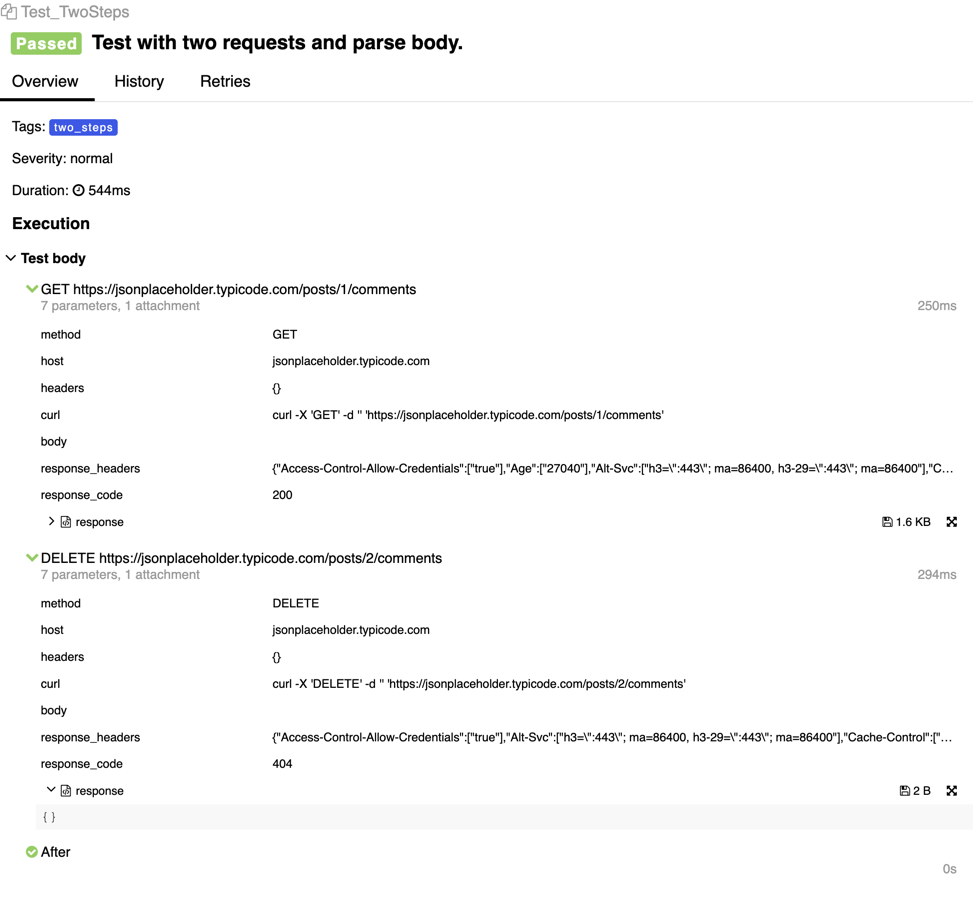
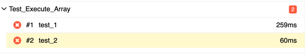
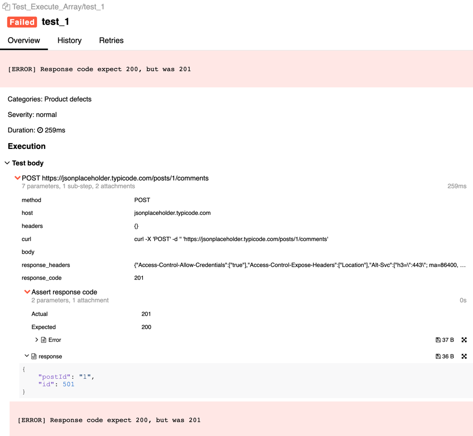
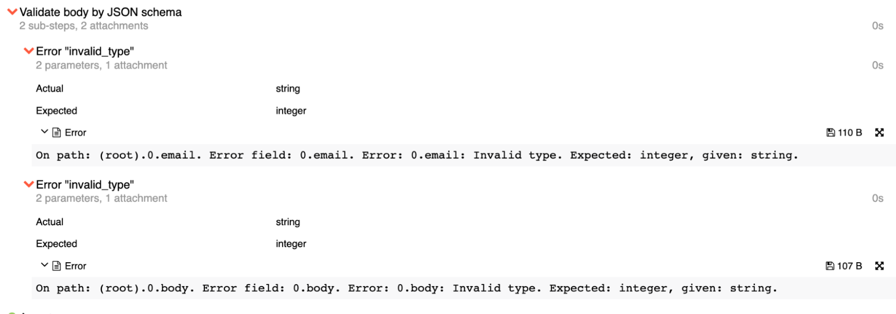

<p align="center">
  
</p>

# CUTE — create your tests easily

HTTP and REST API testing for Go using Allure reports.

## Features

- Expressive and intuitive syntax.
- Built-in JSON support.
- Custom asserts.
- One step to BDD.
- Allure reports.

---

## Head of contents

- [Features](#features)
- [Workflow](#workflow)
- [Installation](#installation)
- [Requirements](#requirements)
- [Demo](#demo)
- [Test examples](#test-examples)
    - [Single test](#single-step-test)
    - [Multi-step test](#multi-step-test)
    - [Suite tests](#suite)
    - [Table tests](#table-tests)
- [Asserts](#asserts)
    - [Ready-made asserts](#ready-made-asserts)
        - [JSON asserts](#json-asserts)
        - [Headers asserts](#headers-asserts)
        - [JSON schema](#json-schema-validations)
    - [Custom asserts](#custom-asserts)
        - [Base](#base)
        - [T](#t)
        - [Errors](#assert-errors)
- [Global Environment Keys](#global-environment-keys)


## Workflow
1. Create a request and write assets.
2. Run tests.
3. Check Allure reports.

## Installation

```bash
  go get -u github.com/ozontech/cute
```

## Requirements

- Go 1.17+


## Demo

Run example.
```bash
  make example
```
To view detailed test reports, install Allure framework. It's optional.

[Learn more about Allure reports](https://github.com/allure-framework)

```bash
  brew install allure
```

Run Allure.

```bash
  allure serve ./examples/allure-results
```

## Test examples

See [**Examples**](examples) directory for featured examples.

### <h3><a href="examples/single_test.go">Single-step test</a></h3>

Allows implementing single-request tests. See full example in the [**Examples**](examples) directory.
To view an Allure report, use `testing.T` or `provider.T` from [allure-go](https://github.com/ozontech/allure-go/blob/master/README_en.md#pkgprovidert).

```go
import (
    "context"
    "net/http"
    "path"
    "testing"
    "time"

    "github.com/ozontech/cute"
    "github.com/ozontech/cute/asserts/json"
)

func TestExample(t *testing.T) {
    cute.NewTestBuilder().
        Title("Title").
        Description("some_description").
        Create().
        RequestBuilder(
            cute.WithURI("https://jsonplaceholder.typicode.com/posts/1/comments"),
            cute.WithMethod(http.MethodGet),
        ).
        ExpectExecuteTimeout(10*time.Second).
        ExpectStatus(http.StatusOK).
        AssertBody(
            json.Equal("$[0].email", "Eliseo@gardner.biz"),
            json.Present("$[1].name"),
        ).
        ExecuteTest(context.Background(), t)
}
```
<details>
  <summary>Allure report</summary>


</details>


### <h3><a href="examples/two_step_test.go">Multi-step test</a></h3>

Allows implementing several requests within one test.

```go
import (
    "context"
    "fmt"
    "net/http"
    "testing"

    "github.com/ozontech/cute"
)
    
func Test_TwoSteps(t *testing.T) {
    responseCode := 0

    // First step
    cute.NewTestBuilder().
        Title("Test with two requests and parse body.").
        Tag("two_steps").
        Create().
        RequestBuilder(
            cute.WithURI("https://jsonplaceholder.typicode.com/posts/1/comments"),
            cute.WithMethod(http.MethodGet),
        ).
        ExpectStatus(http.StatusOK).
        NextTest().

        // Execute after first step and parse response code
        AfterTestExecute(func(response *http.Response, errors []error) error { 
            responseCode = response.StatusCode

            return nil
        }).

        // Second step
        Create().
        RequestBuilder(
            cute.WithURI("https://jsonplaceholder.typicode.com/posts/2/comments"),
            cute.WithMethod(http.MethodDelete),
        ).
        ExecuteTest(context.Background(), t)

        fmt.Println("Response code from first request", responseCode)
}
```
See full in the [**Examples**](examples/two_step_test.go) directory.

<details>
  <summary>Allure report</summary>



</details>

### <h3><a href="examples/suite">Suite</a></h3>

Suite provides a structure for describing tests by organizing them into test suites. It's helpful if you have a large number of different tests and find it difficult to browse through them without using additional layer nesting levels of test calls.

[Learn more about suite with Allure reports](https://github.com/ozontech/allure-go#suite)


1. Declare a structure with `suite.Suite` and `*cute.HTTPTestMaker`.

```go
import (
    "github.com/ozontech/cute"
    "github.com/ozontech/allure-go/pkg/framework/provider"
    "github.com/ozontech/allure-go/pkg/framework/suite"
)

type ExampleSuite struct {
    suite.Suite
    host *url.URL

    testMaker *cute.HTTPTestMaker
}

func (i *ExampleSuite) BeforeAll(t provider.T) {
    // Prepare http test builder
    i.testMaker = cute.NewHTTPTestMaker()

    // Preparing host
    host, err := url.Parse("https://jsonplaceholder.typicode.com/")
    if err != nil {
        t.Fatalf("could not parse url, error %v", err)
    }

    i.host = host
}

```
2. Declare a test.

```go
import (
    "github.com/ozontech/allure-go/pkg/framework/suite"
)

func TestExampleTest(t *testing.T) {
    suite.RunSuite(t, new(ExampleSuite))
}
```

3. Describe tests.

```go
import (
    "github.com/ozontech/cute"
    "github.com/ozontech/cute/asserts/headers"
    "github.com/ozontech/cute/asserts/json"
)

func (i *ExampleSuite) TestExample_OneStep(t provider.T) {
    var (
        testBuilder = i.testMaker.NewTestBuilder()
    )
    
    u, _ := url.Parse(i.host.String())
    u.Path = path.Join(u.Path, "/posts/1/comments")
    
    testBuilder.
        Title("TestExample_OneStep").
        Tags("one_step", "some_local_tag", "json").
        Create().
        StepName("Example GET json request").
        RequestBuilder(
            cute.WithHeaders(map[string][]string{
                "some_header":       []string{"something"},
                "some_array_header": []string{"1", "2", "3", "some_thing"},
            }),
            cute.WithURL(u),
            cute.WithMethod(http.MethodGet),
        ).
        ExpectExecuteTimeout(10*time.Second).
        ExpectJSONSchemaFile("file://./resources/example_valid_request.json").
        ExpectStatus(http.StatusOK).
        AssertBody(
            json.Equal("$[0].email", "Eliseo@gardner.biz"),
            json.Present("$[1].name"),
            json.NotPresent("$[1].some_not_present"),
            json.GreaterThan("$", 3),
            json.Length("$", 5),
            json.LessThan("$", 100),
            json.NotEqual("$[3].name", "kekekekeke"),
        ).
        OptionalAssertBody(
            json.GreaterThan("$", 3),
            json.Length("$", 5),
            json.LessThan("$", 100),
        ).
        AssertHeaders(
            headers.Present("Content-Type"),
        ).
        ExecuteTest(context.Background(), t)
}
```
See full example in the [**Examples**](examples/suite) directory.

<details>
  <summary>Allure report</summary>


</details>

## <h2><a href="examples/table_test/table_test.go">Table tests</a></h2>

You can create a table test in 2 ways. They'll have the same Allure reports.

### Builder table tests

```go
import (
    "context"
    "fmt"
    "net/http"
    "testing"

    "github.com/ozontech/cute"
)

func Test_Table_Array(t *testing.T) {
    tests := []*cute.Test{
        {
            Name:       "test_1",
            Middleware: nil,
            Request: &cute.Request{
                Builders: []cute.RequestBuilder{
                    cute.WithURI("https://jsonplaceholder.typicode.com/posts/1/comments"),
                    cute.WithMethod(http.MethodPost),
                },
            },
            Expect: &cute.Expect{
                Code: 200,
            },
        },
        {
            Name:       "test_2",
            Middleware: nil,
            Request: &cute.Request{
                Builders: []cute.RequestBuilder{
                    cute.WithURI("https://jsonplaceholder.typicode.com/posts/1/comments"),
                    cute.WithMethod(http.MethodGet),
                },
            },
            Expect: &cute.Expect{
                Code: 200,
                AssertBody: []cute.AssertBody{
                    json.Equal("$[0].email", "Eliseo@gardner.biz"),
                    json.Present("$[1].name"),
                    func(body []byte) error {
                        return errors.NewAssertError("example error", "example message", nil, nil)
                    },
                },
            },
        },
    }

    cute.NewTestBuilder().
        Title("Example table test").
        Tag("table_test").
        Description("Execute array tests").
        CreateTableTest().
        PutTests(tests...).
        ExecuteTest(context.Background(), t)
}
```

### Array tests

```go
func Test_Execute_Array(t *testing.T) {
    tests := []*cute.Test{
        {
            Name:       "test_1",
            Middleware: nil,
            Request: &cute.Request{
                Builders: []cute.RequestBuilder{
                    cute.WithURI("https://jsonplaceholder.typicode.com/posts/1/comments"),
                    cute.WithMethod(http.MethodPost),
                },
            },
            Expect: &cute.Expect{
                Code: 200,
            },
        },
        {
            Name:       "test_2",
            Middleware: nil,
            Request: &cute.Request{
                Builders: []cute.RequestBuilder{
                    cute.WithURI("https://jsonplaceholder.typicode.com/posts/1/comments"),
                    cute.WithMethod(http.MethodGet),
                },
            },
            Expect: &cute.Expect{
                Code: 200,
                AssertBody: []cute.AssertBody{
                    json.Equal("$[0].email", "Eliseo@gardner.biz"),
                    json.Present("$[1].name"),
                    func(body []byte) error {
                        return errors.NewAssertError("example error", "example message", nil, nil)
                    },
                },
            },
        },
    }

    for _, test := range tests {
        test.Execute(context.Background(), t)
    }
}
```

See full example in the [**Examples**](examples/table_test/table_test.go) directory.

<details>
  <summary>Allure report</summary>

Common report for all table tests:



Main report:



</details>

<h2><a href="asserts">Asserts</a></h2>

You can create your own asserts or use ready-made from the package asserts.

### Ready-made asserts

#### <h4><a href="asserts/json">JSON asserts</a></h4>


- `Equal` is a function to assert that a JSONPath expression matches the given value.
- `NotEqual` is a function to check that a JSONPath expression value isn't equal to the given value.
- `Length` is a function to assert that value is the expected length.
    - `GreaterThan` is a function to assert that value is greater than the given length.
    - `GreaterOrEqualThan` is a function to assert that value is greater or equal to the given length.
    - `LessThan` is a function to assert that value is less than the given length.
    - `LessOrEqualThan` is a function to assert that value is less or equal to the given length.
- `Present` is a function to assert that value is present. Value can be 0 or null.
- `NotEmpty` is a function to assert that value is present and not empty. Value can't be 0 or null.
- `NotPresent` is a function to assert that value isn't present.
- `Diff` is a function to compare two JSONs.
- `Contains` is a function to assert that a JSONPath expression extracts a value in an array.
- `EqualJSON` is a function to check that a JSON path expression value is equal to given JSON.
- `NotEqualJSON` is a function to check that a JSONPath expression value isn't equal to given JSON.
- `GetValueFromJSON` is a function for getting a value from a JSON.

[Learn more about expressions](https://goessner.net/articles/JsonPath/)

[Learn more about asserts implementation](https://github.com/ozontech/cute/blob/master/asserts/json/json.go)

#### <h4><a href="asserts/headers">Headers asserts</a></h4>

- `Present` is a function to assert that header is present.
- `NotPresent` is a function to assert that header isn't present.

[Learn more about asserts implementation](asserts/headers/headers.go)

#### <h4><a href="jsonschema.go">JSON schema validations</a></h4>

You can validate a JSON schema in 3 ways. Choose a way depending on JSON schema location.

- `ExpectJSONSchemaString(string)` is a function for validating a JSON schema from a string.
- `ExpectJSONSchemaByte([]byte)` is a function for validating a JSON schema from an array of bytes.
- `ExpectJSONSchemaFile(string)` is a function for validating a JSON schema from a file or remote resource.

<details>
  <summary>Allure report</summary>



</details>

### <h3><a href="assert.go">Custom asserts</a></h3>

You can implement [3 type of asserts](assert.go):

#### Base

Types for creating custom assertions.

```go
    type AssertBody func(body []byte) error
    type AssertHeaders func(headers http.Header) error
    type AssertResponse func(response *http.Response) error
```

Example:

```go
func customAssertBody() cute.AssertBody {
    return func(bytes []byte) error {
        if len(bytes) == 0 {
            return errors.New("response body is empty")
        }
        
        return nil
    }
}
```

#### T

Used for creating custom asserts via Allure Actions](https://github.com/ozontech/allure-go#suite) and [testing.TB](https://pkg.go.dev/testing#TB).
You can:

- log information to Allure,
- log error on Allure yourself,
- return an error.

```go
    type AssertBodyT func(t cute.T, body []byte) error
    type AssertHeadersT func(t cute.T, headers http.Header) error
    type AssertResponseT func(t cute.T, response *http.Response) error
```

Example with T:

```go
func customAssertBodyT() cute.AssertBodyT {
    return func(t cute.T, bytes []byte) error {
        require.GreaterOrEqual(t, len(bytes), 100)
        return nil
    }
}
```

Example with creating steps:

```go
func customAssertBodySuite() cute.AssertBodyT {
    return func(t cute.T, bytes []byte) error {
        step := allure.NewSimpleStep("Custom assert step")
        defer func() {
            t.Step(step)
        }()

        if len(bytes) == 0 {
            step.Status = allure.Failed
            step.Attachment(allure.NewAttachment("Error", allure.Text, []byte("response body is empty")))

            return nil
        }

        return nil
    }
}

```

<details>
  <summary>Allure report</summary>


</details>

#### <h4><a href="errors/error.go">Assert errors</a></h4>

You can use `errors.NewAssertError` method from [errors](errors/error.go) package.

Example:

```go
import (
    "github.com/ozontech/cute"
    "github.com/ozontech/cute/errors"
)

func customAssertBodyWithCustomError() cute.AssertBody {
    return func(bytes []byte) error {
        if len(bytes) == 0 {
            return errors.NewAssertError("customAssertBodyWithCustomError", "body must be not empty", "len is 0", "len more 0")
        }

        return nil
    }
}
```
To create a pretty-error in your custom assert, implement it with [interfaces](errors/error.go):

- Name.

```go
type WithNameError interface {
    GetName() string
    SetName(string)
}
```

- Parameters for Allure step.

```go
type WithFields interface {
    GetFields() map[string]interface{}
    PutFields(map[string]interface{})
}
```

<details>
  <summary>Allure report</summary>


</details>

#### Optional assert

If assert returns an optional error, step fails but the test is successful.

You can use  `errors.NewOptionalError(error)` method from [errors](errors/error.go) package.

```go
import (
    "github.com/ozontech/cute"
    "github.com/ozontech/cute/errors"
)

func customAssertBodyWithCustomError() cute.AssertBody {
    return func(bytes []byte) error {
        if len(bytes) == 0 {
            return errors.NewOptionalError("body is empty")
        }

        return nil
    }
}
```

To create optional error, implement error with interface:

```go
type OptionalError interface {
    IsOptional() bool
    SetOptional(bool)
}
```

<details>
  <summary>Allure report</summary>


</details>

## <h2><a href="global_env_keys">Global Environment Keys</a></h2>


| Key | Meaning                                                       | Default                 |
|---|---------------------------------------------------------------|-------------------------|
|`ALLURE_OUTPUT_PATH`| Path to output allure results.                                 | `.` (Folder with tests) |
|`ALLURE_OUTPUT_FOLDER`| Name of result folder.                                            | `/allure-results`       |
|`ALLURE_ISSUE_PATTERN`| Url pattepn to issue. Must contain `%s`.                   |                         |
|`ALLURE_TESTCASE_PATTERN`| URL pattern to TestCase. Must contain `%s`.               |                         |
|`ALLURE_LAUNCH_TAGS`| Default tags for all tests. Tags must be separated by commas. |                         |
