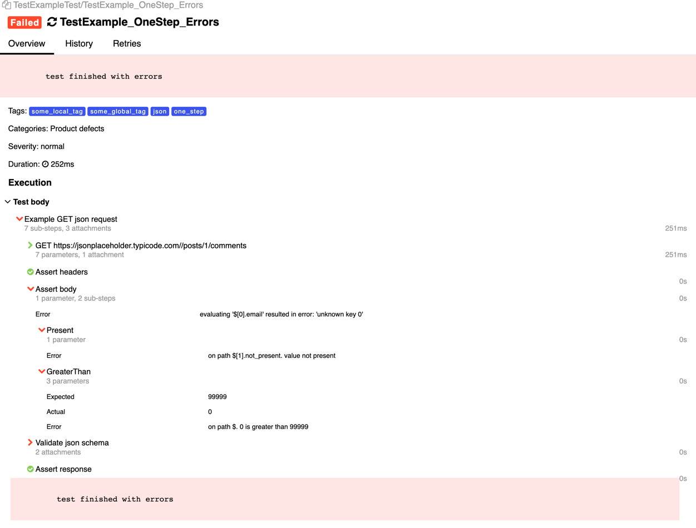
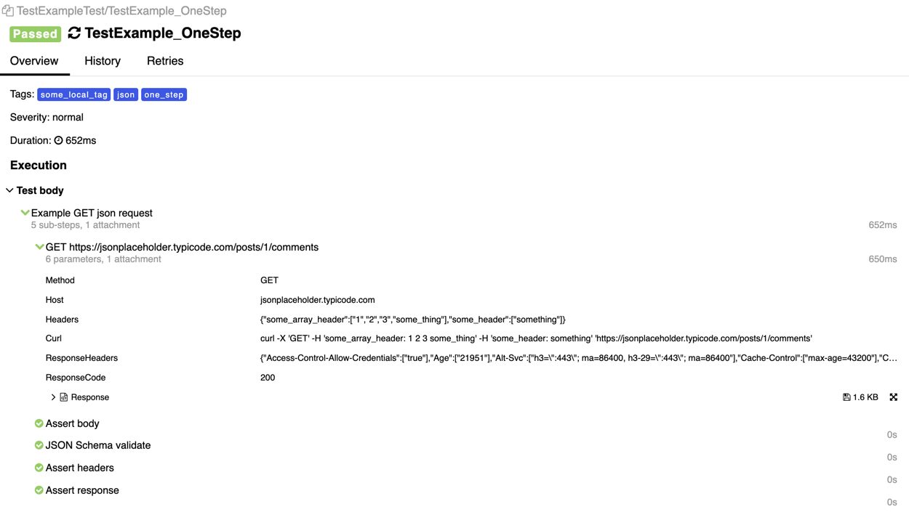
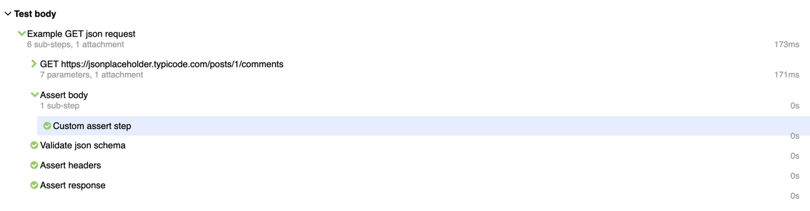
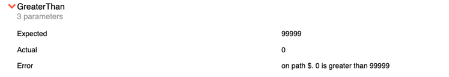
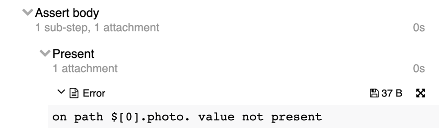

<p align="center">
  
</p>

# CUTE — create your tests easily

HTTP and REST API testing for Go.

Three steps for testing your HTTP service:
1) Create request and write assets
2) Run tests
3) Check allure

---

## Head of contents:

1. [Head of contents](#head-of-contents)
2. [Installation](#installation)
3. [Features](#features)
4. [Demo](#demo)
5. [Examples](#examples)
   1. [Single test with Allure](#example_single_test)
   2. [Suite tests](#example_suite_test)
6. [Asserts](#asserts)
   1. [JSON asserts](#asserts_json)
   2. [Headers asserts](#asserts_headers)
   3. [Custom asserts](#asserts_custom)
      1. [Base](#asserts_custom_base)
      2. [T](#asserts_custom_t)
      3. [Errors](#assert_errors)
7. [Global Environment Keys](#global_env_keys)

## Installation

```bash
go get -u github.com/ozontech/cute
```

## Requirements

- Go 1.17+

## Features

- Full integration with Allure
- Expressive and intuitive syntax
- Built-in JSON support
- Custom asserts
- One step to BDD

## Demo

1) Install allure
```bash
    $ brew install allure
  ```
2) Run example
 ```bash
    $ make example
```

3) Run allure
```bash
    $ allure serve ./examples/allure-results
```

## Examples

See [examples](examples) directory for featured examples.

## <a name="example_single_test"/>Single test

See an example of creating a single test. \
For a result with **allure information** you can use `testing.T` or `provider.T` from [allure-go](https://github.com/ozontech/allure-go/blob/master/README_en.md#pkgprovidert).

```go
import (
    "context"
    "net/http"
    "path"
    "testing"
    "time"

    "github.com/ozontech/cute"
    "github.com/ozontech/cute/asserts/json"
)

func TestExample(t *testing.T) {
    cute.NewTestBuilder().
        Title("Title").
        Description("some_description").
        Create().
        RequestBuilder(
            cute.WithURI("https://jsonplaceholder.typicode.com/posts/1/comments"),
            cute.WithMethod(http.MethodGet),
        ).
        ExpectExecuteTimeout(10*time.Second).
        ExpectStatus(http.StatusOK).
        AssertBody(
            json.Equal("$[0].email", "Eliseo@gardner.biz"),
            json.Present("$[1].name"),
        ).
        ExecuteTest(context.Background(), t)
}
```

See full example [here](examples/single_test.go)

**Allure:**



## <a name="example_suite_test"/>Suite

Suite provides a structure in which you can describe tests by grouping them into test suites. This can be useful if you have a lot of different tests and it is difficult to navigate through them without having additional "layers nesting levels" of test calls.

You can read about `Allure.Suite` [here](https://github.com/ozontech/allure-go/blob/master/README_en.md#configure-suite)

1) Declare a structure with `suite.Suite` and `*cute.HTTPTestMaker`

```go
import (
    "github.com/ozontech/allure-go/pkg/framework/provider"
    
    "github.com/ozontech/cute"
)

type ExampleSuite struct {
    suite.Suite
    host *url.URL

    testMaker *cute.HTTPTestMaker
}

func (i *ExampleSuite) BeforeAll(t provider.T) {
    // Prepare http test builder
    i.testMaker = cute.NewHTTPTestMakerSuite()

    // Preparing host
    host, err := url.Parse("https://jsonplaceholder.typicode.com/")
    if err != nil {
        t.Fatalf("could not parse url, error %v", err)
    }

    i.host = host
}

```
2) Declare test

```go
import (
    "github.com/ozontech/allure-go/pkg/framework/suite"
)

func TestExampleTest(t *testing.T) {
    t.Parallel()
    suite.RunSuite(t, new(ExampleSuite))
}
```

3) Just relax and describe tests

```go
import (
    "github.com/ozontech/cute"
    "github.com/ozontech/cute/asserts/headers"
    "github.com/ozontech/cute/asserts/json"
)

func (i *ExampleSuite) TestExample_OneStep(t provider.T) {
    var (
        testBuilder = i.testMaker.NewTestBuilder()
    )
    
    u, _ := url.Parse(i.host.String())
    u.Path = path.Join(u.Path, "/posts/1/comments")
    
    testBuilder.
        Title("TestExample_OneStep").
        Tags("one_step", "some_local_tag", "json").
        Create().
        StepName("Example GET json request").
        RequestBuilder(
            cute.WithHeaders(map[string][]string{
                "some_header":       []string{"something"},
                "some_array_header": []string{"1", "2", "3", "some_thing"},
            }),
            cute.WithURL(u),
            cute.WithMethod(http.MethodGet),
        ).
        ExpectExecuteTimeout(10*time.Second).
        ExpectJSONSchemaFile("file://./resources/example_valid_request.json").
        ExpectStatus(http.StatusOK).
        AssertBody(
            json.Equal("$[0].email", "Eliseo@gardner.biz"),
            json.Present("$[1].name"),
            json.NotPresent("$[1].some_not_present"),
            json.GreaterThan("$", 3),
            json.Length("$", 5),
            json.LessThan("$", 100),
            json.NotEqual("$[3].name", "kekekekeke"),
        ).
        OptionalAssertBody(
            json.GreaterThan("$", 3),
            json.Length("$", 5),
            json.LessThan("$", 100),
        ).
        AssertHeaders(
            headers.Present("Content-Type"),
        ).
        ExecuteTest(context.Background(), t)
}
```
See full example [here](examples/suite)

**Allure:**



## <a name="asserts"/>Asserts

You can create your own asserts or use ready-made asserts from the package asserts

### <a name="asserts_json"/>JSON asserts:

You can find implementation [here](asserts/json/json.go)

- **Equal** is a function to assert that a jsonpath expression matches the given value
- **NotEqual** is a function to check that jsonpath expression value is not equal to the given value
- **Length** is a function to assert that value is the expected length
- **GreaterThan** is a function to assert that value is greater than the given length
- **LessThan** is a function to assert that value is less than the given length
- **Present** is a function to assert that value is present
- **NotPresent** is a function to assert that value is not present

### <a name="asserts_headers"/>Headers asserts:

See implementation [here](asserts/headers/headers.go)

- **Present** is a function to assert that header is present
- **NotPresent** is a function to assert that header is not present

## <a name="asserts_custom"/>Custom asserts

You can implement [3 type of asserts](assert.go):

### <a name="asserts_custom_base"/>Base

Types for creating custom assertions.

```go
type AssertBody func(body []byte) error
type AssertHeaders func(headers http.Header) error
type AssertResponse func(response *http.Response) error
```

**Example:**

```go
func customAssertBody() asserts.AssertBody {
    return func(bytes []byte) error {
        if len(bytes) == 0 {
            return errors.New("response body is empty")
        }
        
        return nil
    }
}
```

### <a name="asserts_custom_t"/>T

Types for creating custom assertions using Allure [Actions](https://github.com/ozontech/allure-go#configure-suite) and [testing.TB](https://pkg.go.dev/testing#TB). \
You can log some information to Allure. \
Also you can log error on Allure yourself or just return error.

```go
type AssertBodyT func(t cute.T, body []byte) error
type AssertHeadersT func(t cute.T, headers http.Header) error
type AssertResponseT func(t cute.T, response *http.Response) error
```

**Example with T:**

```go
func customAssertBodyTB() cute.AssertBodyT {
    return func(t cute.T, bytes []byte) error {
        require.GreaterOrEqual(t, len(bytes), 100)
        return nil
    }
}
```

**Example with step creations:**
```go
func customAssertBodySuite() cute.AssertBodyT {
    return func(t cute.T, bytes []byte) error {
        step := allure.NewSimpleStep("Custom assert step")
        defer func() {
            t.Step(step)
        }()

        if len(bytes) == 0 {
            step.Status = allure.Failed
            step.Attachment(allure.NewAttachment("Error", allure.Text, []byte("response body is empty")))

            return nil
        }

        return nil
    }
}

```

**Allure:**



### <a name="asserts_errors"/>Assert errors

You can use method `errors.NewAssertError` from package [errors](errors/error.go):

Example:
```go
import (
    "github.com/ozontech/cute"
    "github.com/ozontech/cute/errors"
)

func customAssertBodyWithCustomError() cute.AssertBody {
    return func(bytes []byte) error {
        if len(bytes) == 0 {
            return errors.NewAssertError("customAssertBodyWithCustomError", "body must be not empty", "len is 0", "len more 0")
        }

        return nil
    }
}
```
If you'd like to create a pretty **error in your custom** assert you should implement error with [interfaces](errors/error.go):

##### With name
```go
type WithNameError interface {
    GetName() string
}
```

#### With actual and expected values
```go
type ExpectedError interface {
    GetActual() interface{}
    GetExpected() interface{}
}
```

**Allure:**



#### Optional assert
If assert returns optional error step will be **failed** but test will be success.

You can use method `errors.NewOptionalError(error)` from package [errors](errors/error.go):

```go
import (
    "github.com/ozontech/cute"
    "github.com/ozontech/cute/errors"
)

func customAssertBodyWithCustomError() cute.AssertBody {
    return func(bytes []byte) error {
        if len(bytes) == 0 {
            return errors.NewOptionalError(fmt.Errorf("body is empty"))
        }

        return nil
    }
}
```

To create optional error you should implement error with interface

```go
type OptionalError interface {
    IsOptional() bool
    SetOptional()
}
```

**Allure:**



## <a name="global_env_keys"/>Global Environment Keys


| Key | Meaning                                                       | Default                 |
|---|---------------------------------------------------------------|-------------------------|
|`ALLURE_OUTPUT_PATH`| Path to output allure results                                 | `.` (Folder with tests) |
|`ALLURE_OUTPUT_FOLDER`| Name result folder                                            | `/allure-results`       |
|`ALLURE_ISSUE_PATTERN`| Url pattepn to issue. **Must contain `%s`**                   |                         |
|`ALLURE_TESTCASE_PATTERN`| URL pattern to TestCase. **Must contain `%s`**.               |                         |
|`ALLURE_LAUNCH_TAGS`| Default tags for all tests. Tags must be separated by commas. |                         |
