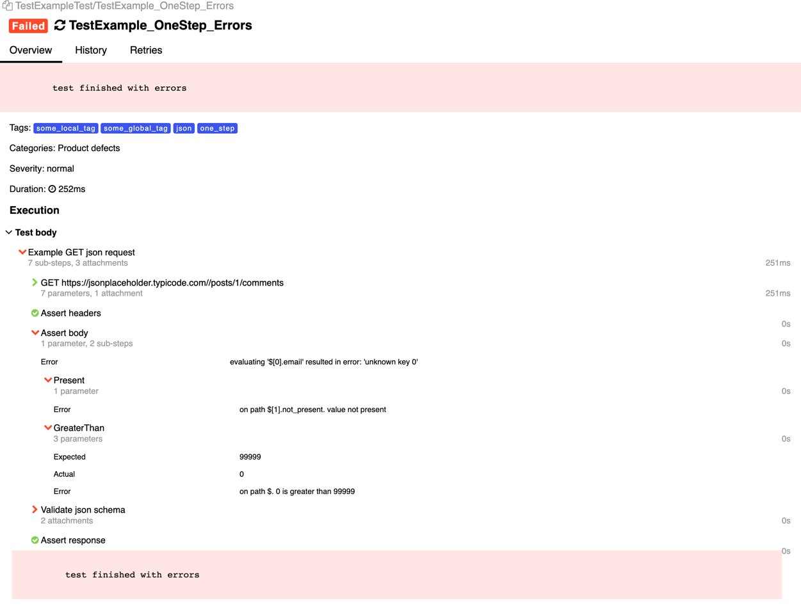
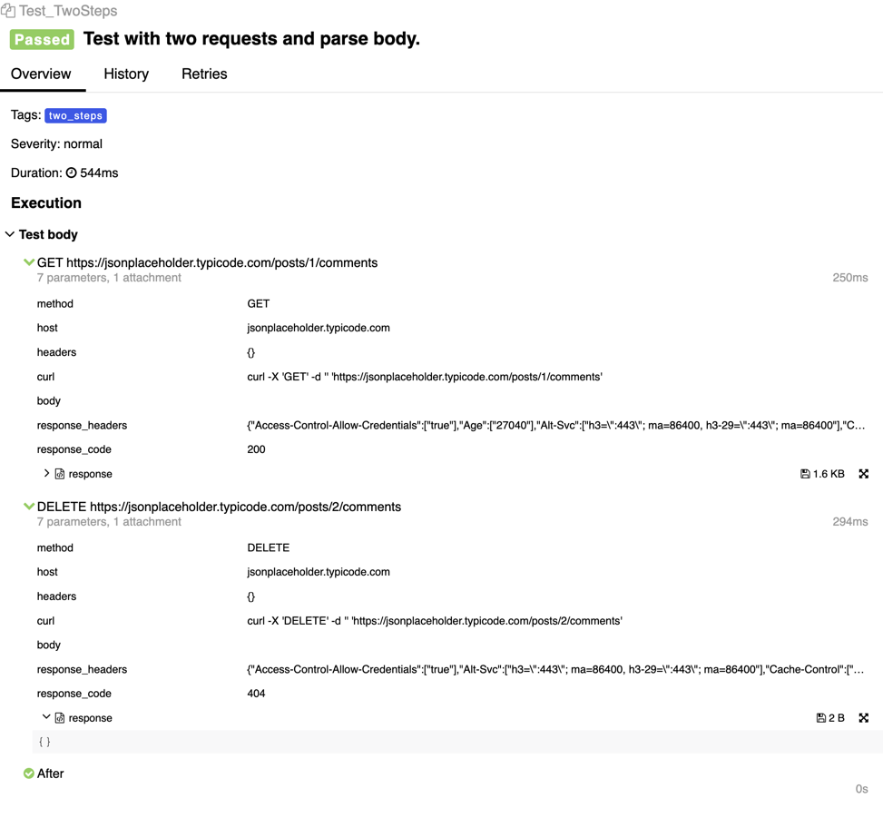
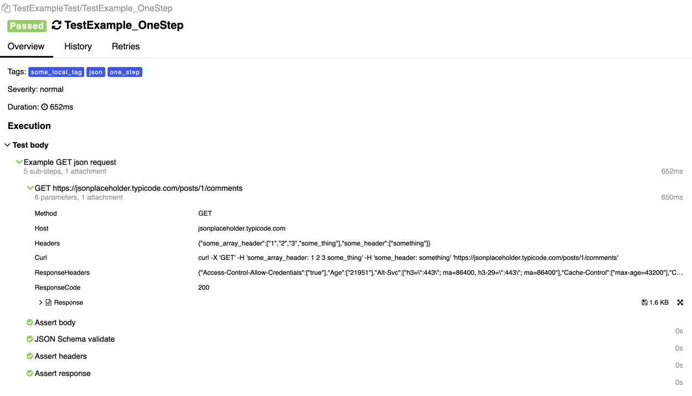
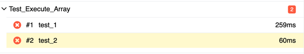
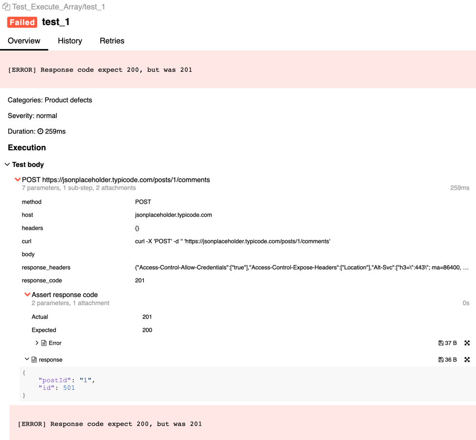
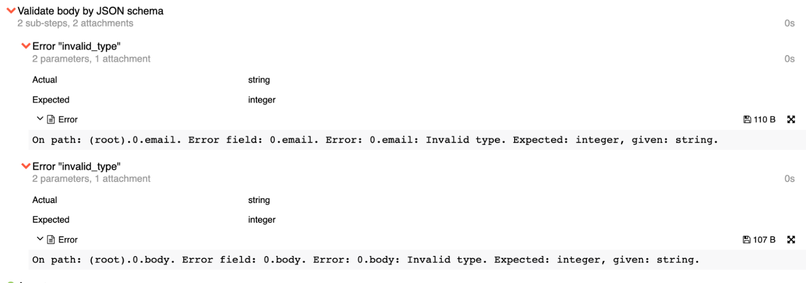
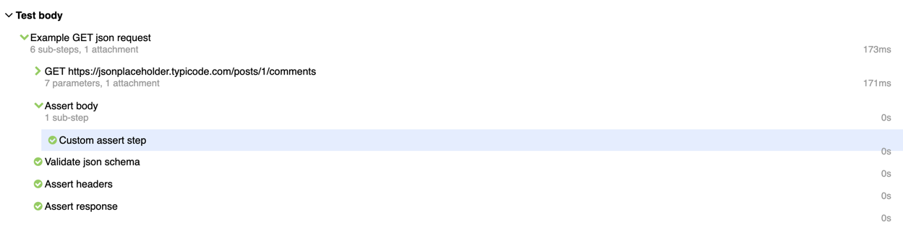
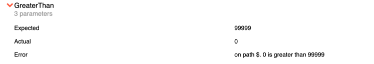
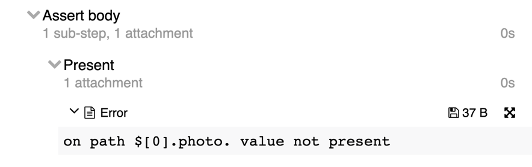

<p align="center">
  
</p>

# CUTE — create your tests easily

HTTP and REST API testing for Go using Allure reports.

Built on the [testo](https://github.com/ozontech/testo) framework with the [testo-allure](https://github.com/ozontech/testo-allure) plugin. Migrating from cute v0.x? See [Migrating from cute v0.x (allure-go)](#migrating-from-cute-v0x-allure-go).

## Features

- Expressive and intuitive syntax.
- Built-in JSON support.
- Custom asserts.
- One step to BDD.
- Allure reports.

---

## Head of contents

- [Features](#features)
- [Workflow](#workflow)
- [Installation](#installation)
- [Requirements](#requirements)
- [Demo](#demo)
- [Test examples](#test-examples)
    - [Single test](#single-step-test)
    - [Multi-step test](#multi-step-test)
    - [Suite tests](#suite)
    - [Table tests](#table-tests)
- [Asserts](#asserts)
    - [Ready-made asserts](#ready-made-asserts)
        - [JSON asserts](#json-asserts)
        - [Headers asserts](#headers-asserts)
        - [JSON schema](#json-schema-validations)
    - [Custom asserts](#custom-asserts)
        - [Base](#base)
        - [T](#t)
        - [Errors](#assert-errors)
- [Allure configuration](#allure-configuration)
- [Migrating from cute v0.x (allure-go)](#migrating-from-cute-v0x-allure-go)


## Workflow
1. Create a request and write assets.
2. Run tests.
3. Check Allure reports.

## Installation

```bash
  go get -u github.com/ozontech/cute
```

## Requirements

- Go 1.24+


## Demo

Run example.
```bash
make example
```
To view detailed test reports, install Allure framework. It's optional.

[Learn more about Allure reports](https://github.com/allure-framework)

```bash
brew install allure
```

Run Allure. All examples write their results to `examples/allure-results` (the root examples via the default `-allure.dir`, the suite example via `allure.WithOutputDir("../allure-results")`, and the table tests via a `TestMain` that sets the `allure.dir` flag).

```bash
allure serve ./examples/allure-results
```

## Test examples

See [**Examples**](examples) directory for featured examples.

### <h3><a href="examples/single_test.go">Single-step test</a></h3>

Allows implementing single-request tests. See full example in the [**Examples**](examples) directory.
`ExecuteTest` accepts a plain `*testing.T` or your [testo](https://github.com/ozontech/testo) T (see [Suite](#suite)) — the Allure report is produced either way.

```go
import (
    "context"
    "net/http"
    "testing"
    "time"

    "github.com/ozontech/cute"
    "github.com/ozontech/cute/asserts/json"
)

func TestExample(t *testing.T) {
    cute.NewTestBuilder().
        Title("Title").
        Description("some_description").
        Create().
        RequestBuilder(
            cute.WithURI("https://jsonplaceholder.typicode.com/posts/1/comments"),
            cute.WithMethod(http.MethodGet),
        ).
        ExpectExecuteTimeout(10*time.Second).
        ExpectStatus(http.StatusOK).
        AssertBody(
            json.Equal("$[0].email", "Eliseo@gardner.biz"),
            json.Present("$[1].name"),
        ).
        ExecuteTest(context.Background(), t)
}
```
<details>
  <summary>Allure report</summary>



</details>


### <h3><a href="examples/two_step_test.go">Multi-step test</a></h3>

Allows implementing several requests within one test.

```go
import (
    "context"
    "fmt"
    "net/http"
    "testing"

    "github.com/ozontech/cute"
)

func Test_TwoSteps(t *testing.T) {
    responseCode := 0

    // First step
    cute.NewTestBuilder().
        Title("Test with two requests and parse body.").
        Tag("two_steps").
        Create().
        RequestBuilder(
            cute.WithURI("https://jsonplaceholder.typicode.com/posts/1/comments"),
            cute.WithMethod(http.MethodGet),
        ).
        ExpectStatus(http.StatusOK).
        NextTest().

        // Execute after first step and parse response code
        AfterTestExecute(func(response *http.Response, errors []error) error {
            responseCode = response.StatusCode

            return nil
        }).

        // Second step
        Create().
        RequestBuilder(
            cute.WithURI("https://jsonplaceholder.typicode.com/posts/2/comments"),
            cute.WithMethod(http.MethodDelete),
        ).
        ExecuteTest(context.Background(), t)

        fmt.Println("Response code from first request", responseCode)
}
```
See full in the [**Examples**](examples/two_step_test.go) directory.

<details>
  <summary>Allure report</summary>



</details>

### <h3><a href="examples/suite">Suite</a></h3>

Suite provides a structure for describing tests by organizing them into test suites. It's helpful if you have a large number of different tests and find it difficult to browse through them without using additional layer nesting levels of test calls.

[Learn more about suites in testo](https://github.com/ozontech/testo/blob/main/docs/tutorial.md#suites)


1. Declare a T struct with `*testo.T` and the Allure plugin, and a suite structure with `testo.Suite[T]` and `*cute.HTTPTestMaker`.

```go
import (
    "net/url"

    "github.com/ozontech/cute"
    "github.com/ozontech/testo"
    allure "github.com/ozontech/testo-allure"
)

type T struct {
    *testo.T
    *allure.PluginAllure
}

type ExampleSuite struct {
    testo.Suite[T]

    host *url.URL

    testMaker *cute.HTTPTestMaker
}

func (i *ExampleSuite) BeforeAll(t T) {
    // Prepare http test builder
    i.testMaker = cute.NewHTTPTestMaker()

    // Preparing host
    host, err := url.Parse("https://jsonplaceholder.typicode.com/")
    if err != nil {
        t.Fatalf("could not parse url, error %v", err)
    }

    i.host = host
}

```
2. Declare a test.

```go
import (
    "testing"

    "github.com/ozontech/testo"
)

func TestExampleTest(t *testing.T) {
    testo.RunSuite(t, new(ExampleSuite))
}
```

3. Describe tests.

```go
import (
    "context"
    "net/http"
    "net/url"
    "path"
    "time"

    "github.com/ozontech/cute"
    "github.com/ozontech/cute/asserts/headers"
    "github.com/ozontech/cute/asserts/json"
)

func (i *ExampleSuite) TestExample_OneStep(t T) {
    var (
        testBuilder = i.testMaker.NewTestBuilder()
    )

    u, _ := url.Parse(i.host.String())
    u.Path = path.Join(u.Path, "/posts/1/comments")

    testBuilder.
        Title("TestExample_OneStep").
        Tags("one_step", "some_local_tag", "json").
        CreateStep("Example GET json request").
        RequestBuilder(
            cute.WithHeaders(map[string][]string{
                "some_header":       []string{"something"},
                "some_array_header": []string{"1", "2", "3", "some_thing"},
            }),
            cute.WithURL(u),
            cute.WithMethod(http.MethodGet),
        ).
        ExpectExecuteTimeout(10*time.Second).
        ExpectJSONSchemaFile("file://./resources/example_valid_request.json").
        ExpectStatus(http.StatusOK).
        AssertBody(
            json.Equal("$[0].email", "Eliseo@gardner.biz"),
            json.Present("$[1].name"),
            json.NotPresent("$[1].some_not_present"),
            json.LengthGreaterThan("$", 3),
            json.Length("$", 5),
            json.LengthLessThan("$", 100),
            json.NotEqual("$[3].name", "kekekekeke"),
        ).
        OptionalAssertBody(
            json.LengthGreaterThan("$", 3),
            json.Length("$", 5),
            json.LengthLessThan("$", 100),
        ).
        AssertHeaders(
            headers.Present("Content-Type"),
        ).
        ExecuteTest(context.Background(), t)
}
```
See full example in the [**Examples**](examples/suite) directory.

<details>
  <summary>Allure report</summary>



</details>

## <h2><a href="examples/table_test/table_test.go">Table tests</a></h2>

You can create a table test in 2 ways. They'll have the same Allure reports.

### Builder table tests

```go
import (
    "context"
    "net/http"
    "testing"

    "github.com/ozontech/cute"
    "github.com/ozontech/cute/asserts/json"
    "github.com/ozontech/cute/errors"
)

func Test_Table_Array(t *testing.T) {
    tests := []*cute.Test{
        {
            Name:       "test_1",
            Middleware: nil,
            Request: &cute.Request{
                Builders: []cute.RequestBuilder{
                    cute.WithURI("https://jsonplaceholder.typicode.com/posts/1/comments"),
                    cute.WithMethod(http.MethodPost),
                },
            },
            Expect: &cute.Expect{
                Code: 200,
            },
        },
        {
            Name:       "test_2",
            Middleware: nil,
            Request: &cute.Request{
                Builders: []cute.RequestBuilder{
                    cute.WithURI("https://jsonplaceholder.typicode.com/posts/1/comments"),
                    cute.WithMethod(http.MethodGet),
                },
            },
            Expect: &cute.Expect{
                Code: 200,
                AssertBody: []cute.AssertBody{
                    json.Equal("$[0].email", "Eliseo@gardner.biz"),
                    json.Present("$[1].name"),
                    func(body []byte) error {
                        return errors.NewAssertError("example error", "example message", nil, nil)
                    },
                },
            },
        },
    }

    cute.NewTestBuilder().
        Title("Example table test").
        Tag("table_test").
        Description("Execute array tests").
        CreateTableTest().
        PutTests(tests...).
        ExecuteTest(context.Background(), t)
}
```

### Array tests

```go
func Test_Execute_Array(t *testing.T) {
    tests := []*cute.Test{
        {
            Name:       "test_1",
            Middleware: nil,
            Request: &cute.Request{
                Builders: []cute.RequestBuilder{
                    cute.WithURI("https://jsonplaceholder.typicode.com/posts/1/comments"),
                    cute.WithMethod(http.MethodPost),
                },
            },
            Expect: &cute.Expect{
                Code: 200,
            },
        },
        {
            Name:       "test_2",
            Middleware: nil,
            Request: &cute.Request{
                Builders: []cute.RequestBuilder{
                    cute.WithURI("https://jsonplaceholder.typicode.com/posts/1/comments"),
                    cute.WithMethod(http.MethodGet),
                },
            },
            Expect: &cute.Expect{
                Code: 200,
                AssertBody: []cute.AssertBody{
                    json.Equal("$[0].email", "Eliseo@gardner.biz"),
                    json.Present("$[1].name"),
                    func(body []byte) error {
                        return errors.NewAssertError("example error", "example message", nil, nil)
                    },
                },
            },
        },
    }

    for _, test := range tests {
        test.Execute(context.Background(), t)
    }
}
```

See full example in the [**Examples**](examples/table_test/table_test.go) directory.

<details>
  <summary>Allure report</summary>

Common report for all table tests:



Main report:



</details>

<h2><a href="asserts">Asserts</a></h2>

You can create your own asserts or use ready-made from the package asserts.

### Ready-made asserts

#### <h4><a href="asserts/json">JSON asserts</a></h4>


- `Equal` is a function to assert that a JSONPath expression matches the given value.
- `NotEqual` is a function to check that a JSONPath expression value isn't equal to the given value.
- `Length` is a function to assert that value is the expected length.
    - `LengthGreaterThan` is a function to assert that value is greater than the given length.
    - `LengthGreaterOrEqualThan` is a function to assert that value is greater or equal to the given length.
    - `LengthLessThan` is a function to assert that value is less than the given length.
    - `LengthLessOrEqualThan` is a function to assert that value is less or equal to the given length.
- `Present` is a function to assert that value is present. Value can be 0 or null.
- `NotEmpty` is a function to assert that value is present and not empty. Value can't be 0 or null.
- `NotPresent` is a function to assert that value isn't present.
- `Diff` is a function to compare two JSONs.
- `Contains` is a function to assert that a JSONPath expression extracts a value in an array.
- `EqualJSON` is a function to check that a JSON path expression value is equal to given JSON.
- `NotEqualJSON` is a function to check that a JSONPath expression value isn't equal to given JSON.
- `GetValueFromJSON` is a function for getting a value from a JSON.

[Learn more about expressions](https://goessner.net/articles/JsonPath/)

[Learn more about asserts implementation](https://github.com/ozontech/cute/blob/master/asserts/json/json.go)

#### <h4><a href="asserts/headers">Headers asserts</a></h4>

- `Present` is a function to assert that header is present.
- `NotPresent` is a function to assert that header isn't present.

[Learn more about asserts implementation](asserts/headers/headers.go)

#### <h4><a href="jsonschema.go">JSON schema validations</a></h4>

You can validate a JSON schema in 3 ways. Choose a way depending on JSON schema location.

- `ExpectJSONSchemaString(string)` is a function for validating a JSON schema from a string.
- `ExpectJSONSchemaByte([]byte)` is a function for validating a JSON schema from an array of bytes.
- `ExpectJSONSchemaFile(string)` is a function for validating a JSON schema from a file or remote resource.

<details>
  <summary>Allure report</summary>



</details>

### <h3><a href="assert.go">Custom asserts</a></h3>

You can implement [3 type of asserts](assert.go):

#### Base

Types for creating custom assertions.

```go
    type AssertBody func(body []byte) error
    type AssertHeaders func(headers http.Header) error
    type AssertResponse func(response *http.Response) error
```

Example:

```go
func customAssertBody() cute.AssertBody {
    return func(bytes []byte) error {
        if len(bytes) == 0 {
            return errors.New("response body is empty")
        }

        return nil
    }
}
```

#### T

Used for creating custom asserts via `cute.T` — a [testo](https://github.com/ozontech/testo) T with the [testo-allure](https://github.com/ozontech/testo-allure) plugin.
You can:

- log information to Allure,
- log error on Allure yourself,
- return an error.

```go
    type AssertBodyT func(t cute.T, body []byte) error
    type AssertHeadersT func(t cute.T, headers http.Header) error
    type AssertResponseT func(t cute.T, response *http.Response) error
```

Example with T:

```go
func customAssertBodyT() cute.AssertBodyT {
    return func(t cute.T, bytes []byte) error {
        require.GreaterOrEqual(t, len(bytes), 100)
        return nil
    }
}
```

Example with creating steps, parameters and attachments:

```go
import (
    "github.com/ozontech/cute"
    allure "github.com/ozontech/testo-allure"
)

func customAssertBodySuite() cute.AssertBodyT {
    return func(t cute.T, bytes []byte) error {
        allure.Step(t, "Custom assert step", func(t cute.T) {
            t.Parameters(allure.NewParameter("body_len", len(bytes)))

            if len(bytes) == 0 {
                t.Attach("Error", allure.Bytes("response body is empty").As(allure.TextPlain))
                t.Status(allure.StatusFailed)
                t.Fail()
            }
        })

        return nil
    }
}
```

<details>
  <summary>Allure report</summary>



</details>

#### <h4><a href="errors/error.go">Assert errors</a></h4>

You can use `errors.NewAssertError` method from [errors](errors/error.go) package.

Example:

```go
import (
    "github.com/ozontech/cute"
    "github.com/ozontech/cute/errors"
)

func customAssertBodyWithCustomError() cute.AssertBody {
    return func(bytes []byte) error {
        if len(bytes) == 0 {
            return errors.NewAssertError("customAssertBodyWithCustomError", "body must be not empty", "len is 0", "len more 0")
        }

        return nil
    }
}
```
To create a pretty-error in your custom assert, implement it with [interfaces](errors/error.go):

- Name.

```go
type WithNameError interface {
    GetName() string
    SetName(string)
}
```

- Parameters for Allure step.

```go
type WithFields interface {
    GetFields() map[string]interface{}
    PutFields(map[string]interface{})
}
```

<details>
  <summary>Allure report</summary>



</details>

#### Optional assert

If assert returns an optional error, step fails but the test is successful.

You can use  `errors.NewOptionalError(error)` method from [errors](errors/error.go) package.

```go
import (
    "github.com/ozontech/cute"
    "github.com/ozontech/cute/errors"
)

func customAssertBodyWithCustomError() cute.AssertBody {
    return func(bytes []byte) error {
        if len(bytes) == 0 {
            return errors.NewOptionalError("body is empty")
        }

        return nil
    }
}
```

To create optional error, implement error with interface:

```go
type OptionalError interface {
    IsOptional() bool
    SetOptional(bool)
}
```

<details>
  <summary>Allure report</summary>



</details>

## <h2><a href="https://github.com/ozontech/testo-allure?tab=readme-ov-file#flags">Allure configuration</a></h2>

Allure output is configured by [testo-allure](https://github.com/ozontech/testo-allure). The allure-go output-path environment keys (`ALLURE_OUTPUT_PATH`, `ALLURE_OUTPUT_FOLDER`) are gone — use the `-allure.dir` flag or the `allure.WithOutputDir` option instead. The link-pattern environment keys (`ALLURE_ISSUE_PATTERN`, `ALLURE_TESTCASE_PATTERN`, `ALLURE_LINK_TMS_PATTERN`) still work with `SetIssue`, `SetTestCase` and `TmsLink(s)`, exactly as in allure-go.

Set the output directory with the `-allure.dir` flag (default `allure-results`):

```bash
  go test ./... -allure.dir /some/custom/dir/my-allure-results
```

Or in code, pass the `allure.WithOutputDir(dir)` option to `testo.RunSuite` / `testo.RunTest` / `testo.Test`:

```go
func TestExampleTest(t *testing.T) {
    testo.RunSuite(t, new(ExampleSuite), allure.WithOutputDir("./allure-results"))
}
```

`ALLURE_TESTPLAN_PATH` (selective test run via an Allure TestOps testplan) still works.

See the [testo-allure README](https://github.com/ozontech/testo-allure?tab=readme-ov-file#flags) for the full list of flags and options.

## Migrating from cute v0.x (allure-go)

Cute is now built on [testo](https://github.com/ozontech/testo) with the [testo-allure](https://github.com/ozontech/testo-allure) plugin instead of [allure-go](https://github.com/ozontech/allure-go). The builder method names are unchanged (a few allure argument types moved from pointers to values); only the test-framework layer differs:

- Declare a T struct and use it everywhere `provider.T` was used before:

```go
type T struct {
    *testo.T
    *allure.PluginAllure
}
```

- `ExecuteTest(ctx, t)` and `Test.Execute(ctx, t)` still accept a plain `*testing.T` as well as your T.
- Runner: `runner.Run(t, "name", func(t provider.T) {...})` → `t.Run("name", testo.Test(func(t T) {...}))`.

Renamed methods and types:

| allure-go (cute v0.x)                          | testo-based cute                                          |
|------------------------------------------------|-----------------------------------------------------------|
| `suite.Suite`                                  | `testo.Suite[T]`                                          |
| `suite.RunSuite(t, new(S))`                    | `testo.RunSuite(t, new(S))`                               |
| `provider.T` / `provider.StepCtx`              | `cute.T` / your T                                         |
| `t.WithNewStep("name", func(sCtx provider.StepCtx) {...})` | `allure.Step(t, "name", func(t T) {...})`     |
| `t.WithNewParameters("k", "v")`                | `t.Parameters(allure.NewParameter("k", "v"))`             |
| `t.WithNewAttachment(name, mime, content)`     | `t.Attach(name, allure.Bytes(content).As(mediaType))`     |
| `t.BrokenNow()`                                | `t.Status(allure.StatusBroken); t.FailNow()`              |
| `allure.Failed` / `allure.Broken` / `allure.Skipped` | `allure.StatusFailed` / `allure.StatusBroken` / `allure.StatusSkipped` |
| `allure.SeverityType` constants (`allure.CRITICAL`, ...) | `allure.Severity` constants (`allure.SeverityCritical`, ...) |
| `*allure.Link` (pointer)                       | `allure.Link` (value) — `allure.NewLink(url)`, `allure.Issue(s)`, `allure.TMS(s)` |
| `*allure.Label` (pointer)                      | `allure.Label` (value) — also `Labels(...allure.Label)` |

Behavior changes:

- Failures inside `CreateStep(...)` now fail the test. Previously a failed
  expectation inside a step only marked the allure step as failed while
  `go test` still passed — testo correctly promotes step failures to the test.
- Table tests (`CreateTableTest`) still produce a separate Allure result per
  entry, but run as child tests of your test function; they use the default
  allure plugin, so plugins from a custom suite T are not propagated to them.
- `Stage`/`Stagef` now emit a label named `stage` instead of setting the allure
  result's `stage` field — testo-allure has no result-level stage; the value is
  preserved best-effort as a label.

See the [testo migration guide](https://github.com/ozontech/testo/blob/main/docs/migration.md) for the full framework-level migration.
